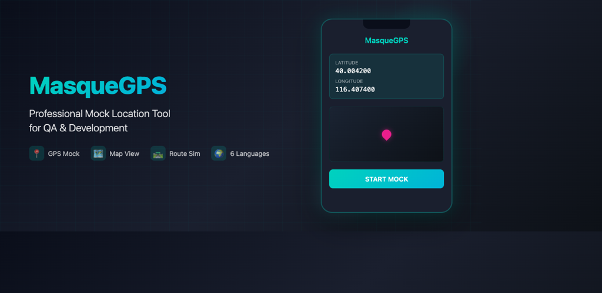
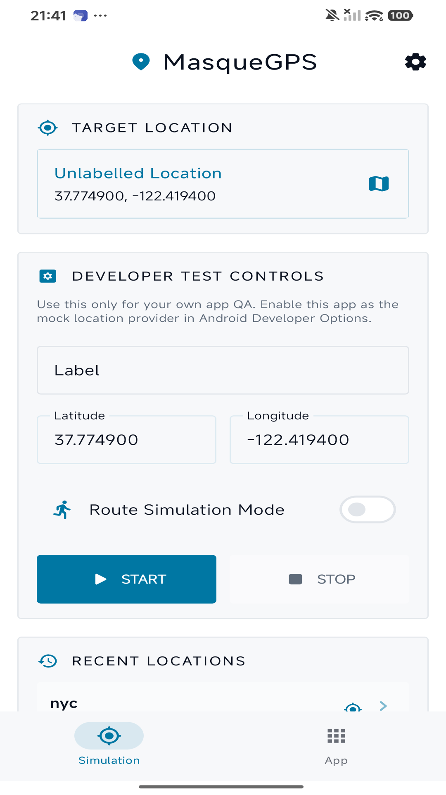
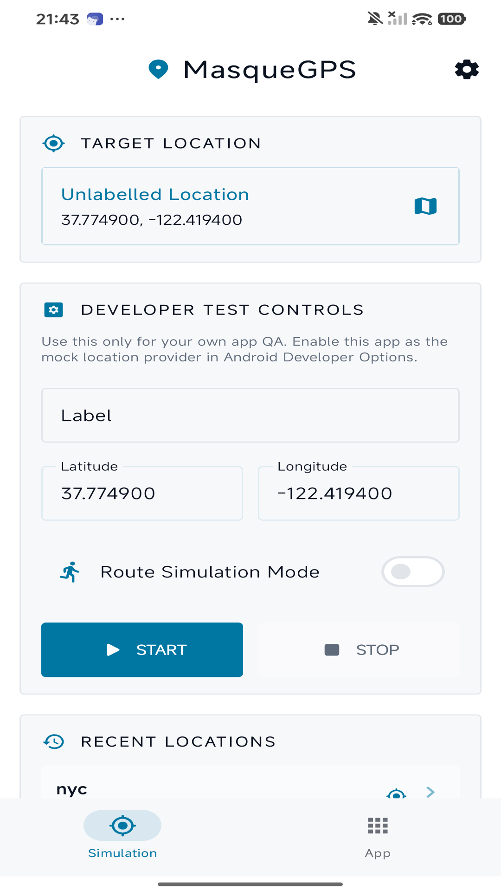
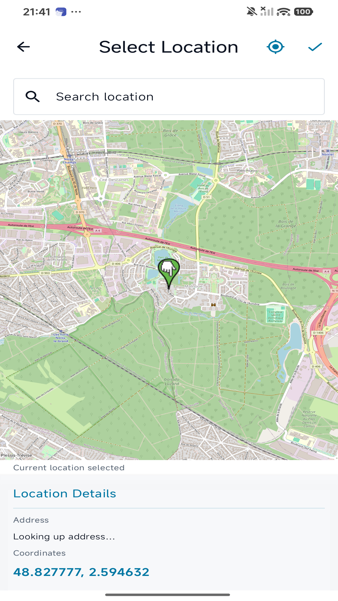
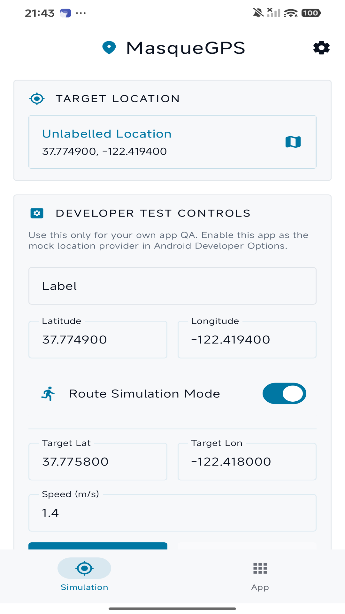
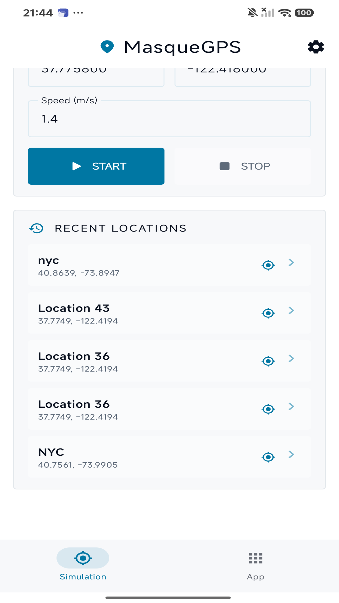
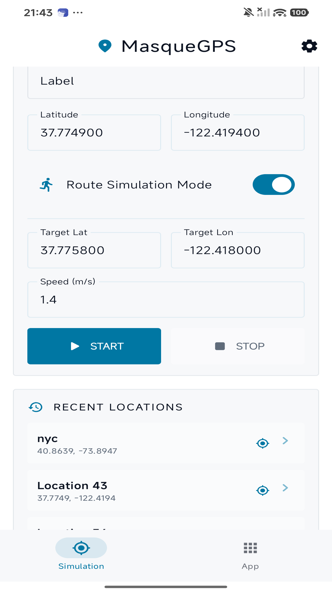
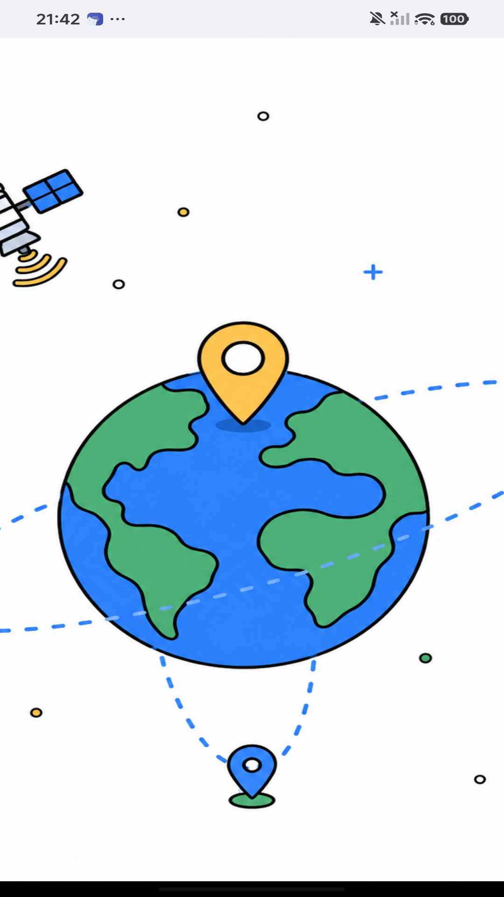

  

  <a href="#english">English</a> | <a href="#中文">中文</a>

  
  
  

---

# English

## Professional Mock Location Tool for QA & Development

**MasqueGPS** is a professional-grade mock location utility designed for developers, QA engineers, and authorized testing workflows. Simulate GPS coordinates on Android devices for testing location-dependent applications.

### ⚠️ Important Notice Before Purchase

> **Root access is strongly recommended.** While a non-root mode (Shizuku) is available, it has significant limitations including unstable mock location that may be overridden within minutes. **Non-root users are advised NOT to purchase.**

### Key Features

- 📍 **GPS Mock Location** — Simulate precise GPS coordinates
- 🗺️ **Interactive Map** — Tap to select location or search by place name
- 🛣️ **Route Simulation** — Simulate movement between two points at configurable speed
- 📝 **Location History** — Save and reuse frequently tested locations
- 🎨 **Dark/Light Theme** — Automatic theme switching
- 🌍 **Multi-Language** — English, Chinese, French, Spanish, German, Japanese
- 🔔 **Notification Controls** — Start/Stop from notification bar

### Screenshots

  
  
  
  

  
  
  
  

### Privacy & Security

| Feature | Details |
|---------|---------|
| **Data Storage** | 100% local — all data stays on your device |
| **External Servers** | None — no connection to developer servers |
| **Data Collection** | None — no analytics, no tracking, no telemetry |
| **Network Usage** | Map tiles only — manual coordinate entry works fully offline |

### Requirements

| Requirement | Root Mode | Shizuku Mode |
|-------------|-----------|--------------|
| **Root Access** | ✅ Required (Magisk/KernelSU/APatch) | ❌ Not required |
| **Stability** | ✅ Stable | ⚠️ Unstable (may revert in minutes) |
| **Detection Risk** | Low | Higher |
| **Recommended** | ✅ Yes | ❌ No |

### Compatibility

- **Android Version**: 7.0+ (API 24)
- **Tested Devices**: Xiaomi, Redmi, POCO (HyperOS/MIUI)
- **Chipset**: All (Qualcomm, MediaTek, Exynos, Tensor)
- **Not Supported**: Huawei (no GMS)

See [COMPATIBILITY.md](COMPATIBILITY.md) for detailed device compatibility.

### Legal

See [ABOUT.md](ABOUT.md) for full terms of use, disclaimer, and refund policy.

### Download

### Support

- 📧 Issues: [GitHub Issues](https://github.com/sinonchum/MasqueGPS/issues)
- 📖 Documentation: [ABOUT.md](ABOUT.md)

---

# 中文

## 专业级模拟定位工具 — QA 与开发专用

**MasqueGPS** 是一款专业级模拟定位工具，专为开发者、QA 工程师和授权测试场景设计。可在 Android 设备上模拟 GPS 坐标，用于测试位置相关的应用程序。

### ⚠️ 购买前请务必阅读

> **强烈建议使用 Root 设备。** 非 Root 模式（Shizuku）存在显著限制，包括模拟位置不稳定、可能在数分钟内被真实位置覆盖。**不建议非 Root 用户购买。**

### 核心功能

- 📍 **GPS 模拟定位** — 精确模拟 GPS 坐标
- 🗺️ **交互式地图** — 点击选择位置或按地名搜索
- 🛣️ **路线模拟** — 按设定速度在两点间模拟移动
- 📝 **位置历史** — 保存并重用常用测试位置
- 🎨 **深色/浅色主题** — 自动跟随系统主题
- 🌍 **多语言支持** — 中文、英文、法语、西班牙语、德语、日语
- 🔔 **通知栏控制** — 从通知栏快速启停

### 截图展示

  
  
  
  

  
  
  
  

### 隐私与安全

| 特性 | 说明 |
|------|------|
| **数据存储** | 100% 本地 — 所有数据仅存储在您的设备上 |
| **外部服务器** | 无 — 不连接开发者服务器 |
| **数据收集** | 无 — 无分析、无追踪、无遥测 |
| **网络用途** | 仅加载地图瓦片 — 手动输入经纬度可完全离线使用 |

### 使用要求

| 要求 | Root 模式 | Shizuku 模式 |
|------|-----------|--------------|
| **Root 权限** | ✅ 必需（Magisk/KernelSU/APatch） | ❌ 不需要 |
| **稳定性** | ✅ 稳定 | ⚠️ 不稳定（可能数分钟内恢复真实位置） |
| **检测风险** | 低 | 较高 |
| **推荐购买** | ✅ 是 | ❌ 否 |

### 兼容性

- **Android 版本**: 7.0+（API 24）
- **已测试设备**: 小米、Redmi、POCO（HyperOS/MIUI）
- **芯片支持**: 全部（高通、联发科、Exynos、Tensor）
- **不支持**: 华为（无 GMS）

详见 [COMPATIBILITY.md](COMPATIBILITY.md)。

### 法律条款

详见 [ABOUT.md](ABOUT.md) 包含完整使用条款、免责声明和退款政策。

### 下载

### 技术支持

- 📧 问题反馈: [GitHub Issues](https://github.com/sinonchum/MasqueGPS/issues)
- 📖 文档: [ABOUT.md](ABOUT.md)

---

  © 2026 MasqueGPS. All rights reserved.

